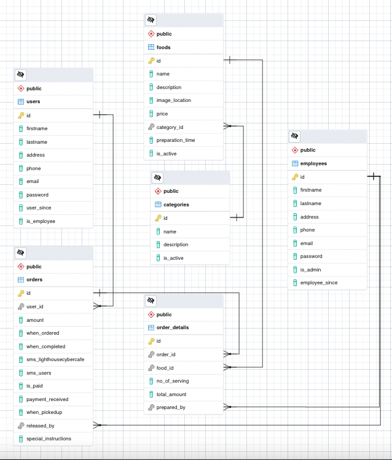
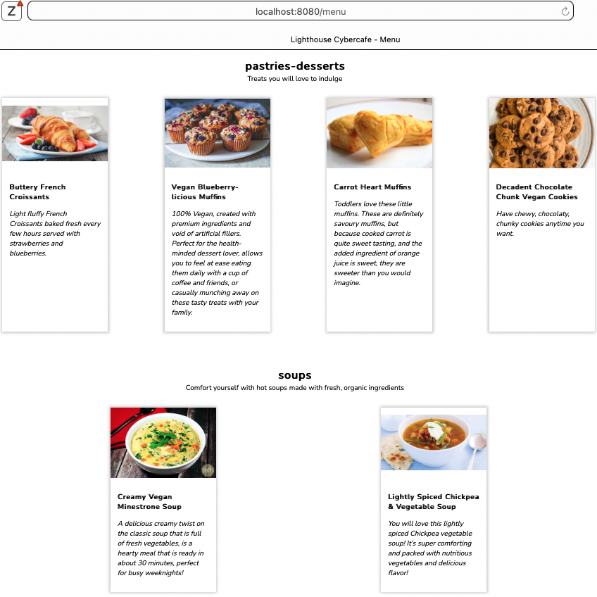
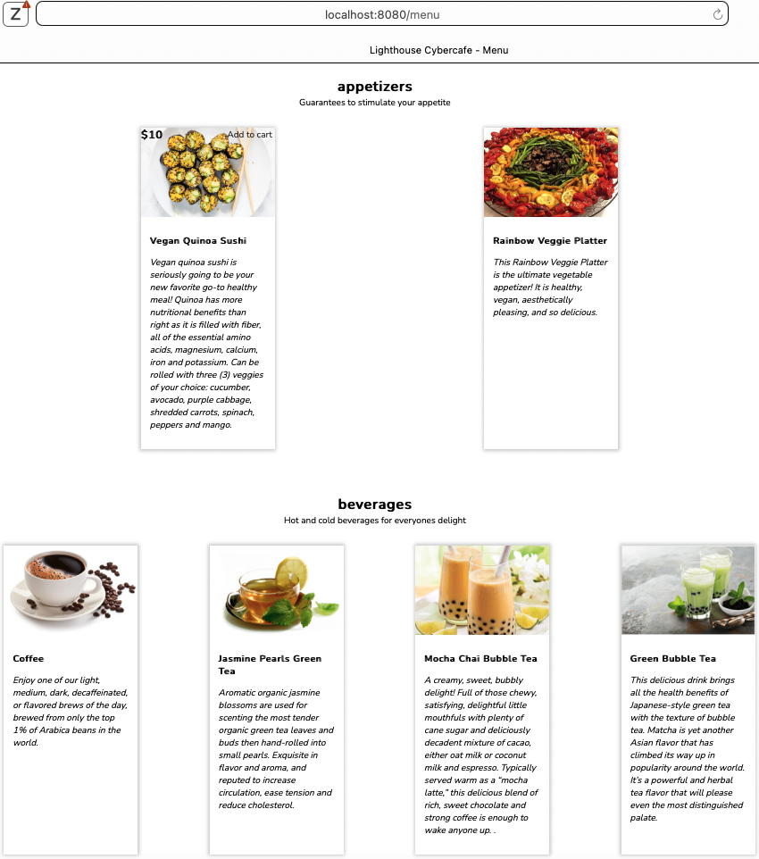
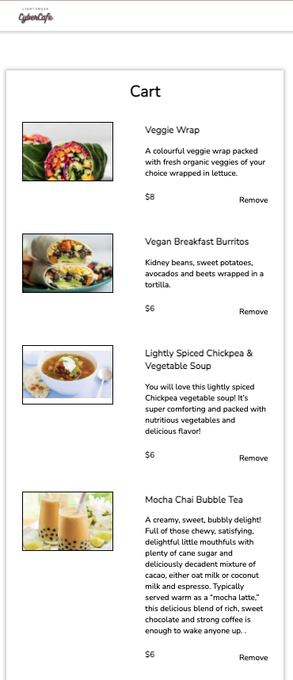
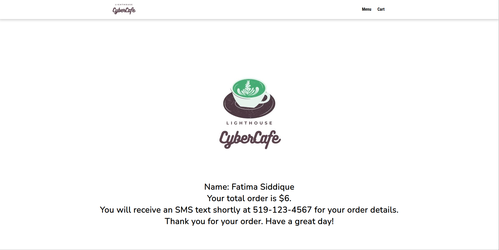
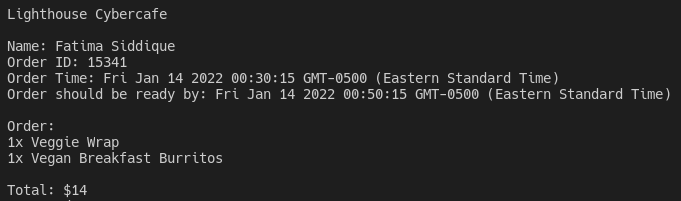

# Lighthouse Cyber Cafe - Food PickUp Ordering App

A food ordering experience for a single restaurant. Hungry clients of this fictitious restaurant can visit its website, select one or more dishes and place an order for pick-up. They will receive a confirmation message when their order is placed and when it is ready for a pick-up.

The restaurant and client both are both notified since this app serves as an intermediary.
Every time an order is placed the restaurant receives a notification via SMS.

A modern telecomm API service Twilio is used to implement SMS communication from the website to the client and restaurant.

## Collaboration

- [Fatima](https://github.com/FatimaSidq)
- [Osman](https://github.com/OsmanShakib)
- [Stella](https://github.com/goodWishesEveryone)

## Project Stack

- **Front-End: HTML, SASS, JavaScript, jQuery**
- **Back-End: Nodejs, Express, PSQL**

## Database Design

## Project Features

#### For Users
- Users can choose to see the list of available menu items from the homepage.
- Users can select menu items listed by category.
- Users can see the details, description and price of an individual item.
- Users can add and remove items to the cart.
- Users can see the content of their cart and the order running total.
- Users can submit their order when they are ready to pay.
- Users receive a personalized SMS order confirmation and order details once order is submitted with a time estimate for the order to be available for pick-up
#### For Restaurant Administrator
- Restaurant administrator receives an SMS with the order id, customer's name, and order details when a new order is placed.

# Final Product

## Menu

## Cart and Summary

## Order Confirmation 

## SMS 

## Getting Started

1. Create the `.env` by using `.env.example` as a reference: `cp .env.example .env`
2. Update the .env file with your correct local information 
  - username: `labber` 
  - password: `labber` 
  - database: `midterm`
3. Install dependencies: `npm i`
4. Fix to binaries for sass: `npm rebuild node-sass`
5. Reset database: `npm run db:reset`
  - Check the db folder to see what gets created and seeded in the SDB
7. Run the server: `npm run start`
  - Note: nodemon is used, so you should not have to restart your server
8. Visit `http://localhost:8080/`
  - please visit `http://localhost:8080/login/2`  --> as admin
  - please visit `http://localhost:8080/login/4` --> as a user

## Dependencies

- Node 10.x or above
- NPM 5.x or above
- pg
- body-parser
- cookie-parser
- chalk
- dotenv
- ejs
- express
- morgan
- twilio

## Warnings & Tips

- Do not edit the `layout.css` file directly, it is auto-generated by `layout.scss`
- Split routes into their own resource-based file names, as demonstrated with `users.js` and `widgets.js`
- Split database schema (table definitions) and seeds (inserts) into separate files, one per table. See `db` folder for pre-populated examples. 
- Use the `npm run db:reset` command each time there is a change to the database schema or seeds. 
  - It runs through each of the files, in order, and executes them against the database. 
  - Note: you will lose all newly created (test) data each time this is run, since the schema files will tend to `DROP` the tables and recreate them.
